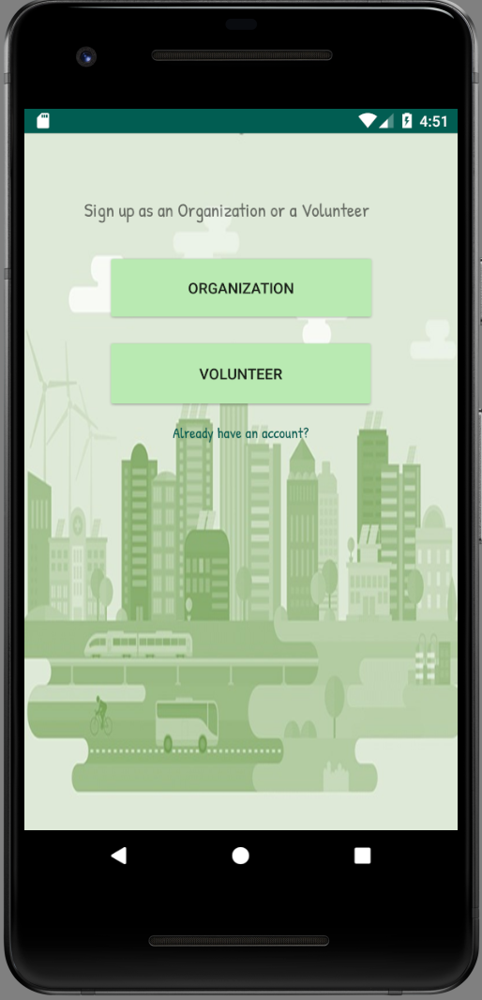
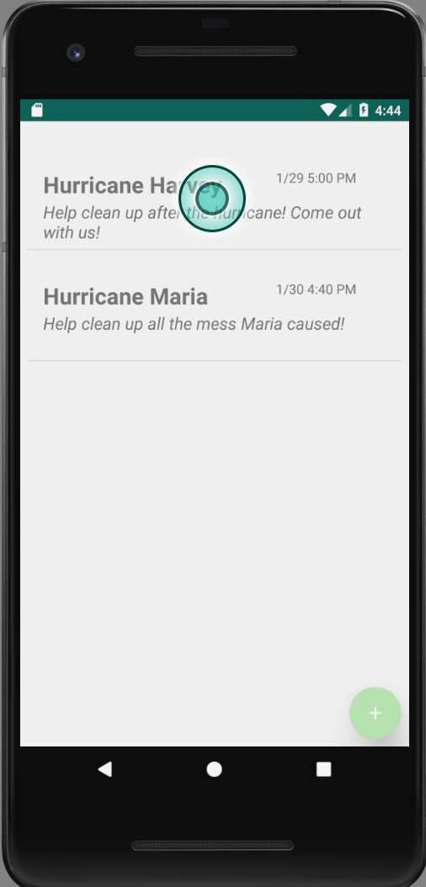
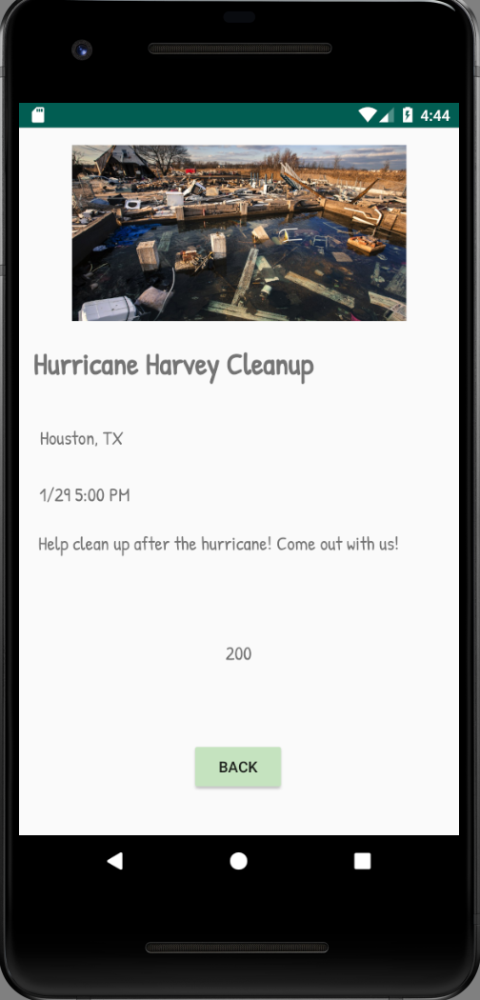

# TAMUHack - Group Volunteering App
As part of TAMUHack, we designed a group volunteering app that allows organizations to setup events for other people to join. The app was built for Android with a Firebase backend to provide real-time event updates.

## Some Images

